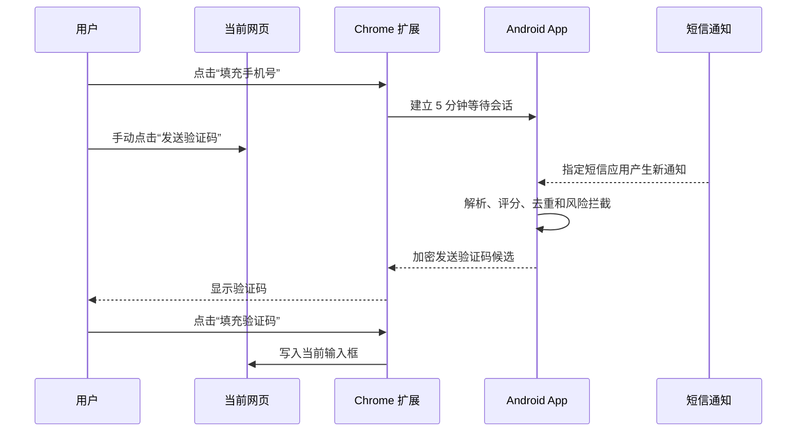

# OTP LAN Bridge

> 将 Android 短信通知中的一次性验证码，通过局域网、Tailscale 或 USB 加密传送到 Chrome，并在用户确认后填入当前网页。

[](#系统要求)
[](#系统要求)
[](LICENSE)

OTP LAN Bridge 由一个 Android App 和一个 Chrome Manifest V3 扩展组成。它不依赖公网中转服务，不申请 `READ_SMS` 或 `RECEIVE_SMS` 权限，也不会自动点击网页的“发送验证码”“登录”或“提交”按钮。

## 为什么做这个项目

在电脑上登录网站时，验证码通常到达手机。复制、切换设备和手工输入看似只是几秒，却会在高频登录、申请表单和多账号工作流中不断打断操作。

本项目把这段流程缩短为：

1. 在网页中选中手机号输入框，点击扩展面板填入手机号。
2. 用户自己点击网站的“发送验证码”。
3. Android 仅在 5 分钟等待窗口内读取指定短信应用的新通知。
4. 验证码通过加密 WebSocket 到达发起等待的标签页。
5. 用户点击扩展面板，将验证码填入当前输入框。

项目始终把发送、填充和提交的最终决定留给用户。

## 核心特性

- **最小权限**：Android 使用通知监听，不读取短信数据库；无需 `READ_SMS`、`RECEIVE_SMS`。
- **本地优先**：支持同一局域网、Tailscale 私有网络和 USB ADB 转发，不需要自建公网服务器。
- **端到端保护**：P-256 ECDH、HKDF、AES-256-GCM、随机 nonce、单调序号和重放保护。
- **显式等待窗口**：没有浏览器发起的有效等待会话时，App 不处理通知正文。
- **风险拦截**：包含银行、支付、付款、钱包、转账、交易等高风险关键词的通知不会转发。
- **通用网页填充**：支持原生输入框、`textarea`、`contenteditable`、常见前端框架和分格 OTP 输入框。
- **不自动提交**：扩展只填值，不点击发送、登录、确认或提交按钮。
- **持久配对**：首次使用 6 位临时码配对；后续重启通常只需让两端网络和服务恢复，不必重复配对。

## 工作原理



## 系统要求

- Android 8.0（API 26）或更高版本。
- Chrome 116 或更高版本。
- Android 构建：JDK 17、Android SDK Platform 35。
- Chrome 扩展构建：Node.js 20 或更高版本。

目前仅支持 Android。iOS 不允许普通 App 以相同方式读取其他 App 的通知，因此不能直接复用此实现。

## 快速开始

### 1. 构建 Android App

```powershell
cd android
.\gradlew.bat testDebugUnitTest lintDebug assembleDebug
```

生成的调试 APK 位于：

```text
android/app/build/outputs/apk/debug/app-debug.apk
```

可以将 APK 发送到手机安装，或通过 ADB 安装：

```powershell
adb install -r android\app\build\outputs\apk\debug\app-debug.apk
```

### 2. 构建 Chrome 扩展

```powershell
cd extension
npm ci
npm run check
npm test
npm run build
```

然后打开 `chrome://extensions`：

1. 启用“开发者模式”。
2. 点击“加载已解压的扩展程序”。
3. 选择 `extension/dist`。

### 3. 配置 Android

1. 打开 OTP LAN Bridge。
2. 选择系统默认短信应用；无法识别时填写短信应用包名。
3. 点击“授予通知使用权”，在系统页面中允许“验证码桥接”。
4. 按手机系统提示允许通知、后台运行和自启动。
5. 启动桥接服务，记录 App 显示的地址、端口和 6 位临时配对码。

### 4. 完成首次配对

1. 打开扩展设置页。
2. 填写手机地址、端口和配对码。
3. 保持 Android App 配对页处于前台，点击“配对”。
4. Chrome 询问本地网络访问时选择“允许”。
5. 配对成功后填写常用手机号并保存。

配对码有效期为 30 分钟且仅用于首次配对。配对密钥会分别保存在 Android Keystore 和 Chrome 本地存储中，正常重启后无需重新配对。

## 三种连接方式

| 方式 | 适用场景 | 扩展填写地址 |
| --- | --- | --- |
| 局域网 | 手机和电脑可以在同一网络中互访 | App 显示的 `192.168.x.x` 地址 |
| Tailscale | 更换 Wi-Fi、网络开启客户端隔离或需要稳定私有地址 | 手机的 `100.x.y.z` 地址 |
| USB | 无线网络不可互访，且可以使用 USB 调试 | `127.0.0.1` |

- Tailscale 配置见 [docs/TAILSCALE_MODE.md](docs/TAILSCALE_MODE.md)。
- USB 配置见 [docs/USB_MODE.md](docs/USB_MODE.md)。

## 日常使用

1. 确保 Android 桥接服务运行、通知监听已连接。
2. 使用 Tailscale 时，手机和电脑两端都要保持 Tailscale 已连接；窗口可以关闭，后台服务不能退出。
3. 点击网页手机号输入框，再点击扩展面板“填充手机号”。
4. 手动点击网页自己的“发送验证码”。
5. 验证码到达后，点击网页验证码输入框，再点击扩展面板“填充验证码”。

## 安全与隐私

OTP LAN Bridge 处理的是敏感认证信息，因此默认采用以下边界：

- 完整短信正文只存在于 Android 通知回调的内存中，不写入磁盘或调试日志。
- 只有用户选定的短信应用通知会被考虑。
- 只有活动等待会话中的新通知会被解析和发送。
- OTP 在 Chrome 中只保存于 `chrome.storage.session`，最长保留 2 分钟。
- 手机号和配对材料不使用 Chrome 同步存储。
- 所有业务消息均经过认证加密，并校验设备、会话、时间戳、序号和 nonce。
- 服务只接受回环地址、私有局域网地址和 Tailscale CGNAT 地址，不接受公网来源。
- 扩展不会自动触发网站操作，避免未经用户确认的发送、登录或提交。

## 常见问题

### 配对时提示无法连接

- 确认 Android App 配对页在前台、桥接服务正在运行。
- 确认地址和端口与 App 当前显示一致。
- Chrome 请求“连接本地网络设备”权限时选择允许。
- 同一 Wi-Fi 仍无法互访时，路由器可能启用了 AP/客户端隔离，请改用 Tailscale 或 USB。
- 使用 Clash/Mihomo TUN 时，将当前局域网网段或 `100.64.0.0/10` 配置为直连/排除网段。

### 模拟通知正常，真实短信没有传到电脑

- 检查系统通知监听状态是否为“已连接”。
- 确认选择的短信应用包名与真实通知来源一致。
- 确认短信通知没有被系统隐私设置隐藏正文。
- 先在网页点击手机号输入框和“填充手机号”，确保扩展已进入等待状态。

### 重启后是否需要重新配对

通常不需要。只要没有清除 App/扩展数据、解除配对或重新安装，原配对会持续有效。重启后需要恢复 Android 桥接服务，以及局域网/Tailscale/USB 连接。

## 开发与测试

```powershell
# Android
cd android
.\gradlew.bat testDebugUnitTest lintDebug

# Chrome extension
cd extension
npm ci
npm run check
npm test
npm run build
```

## 项目状态

当前版本已在 Android 15、Windows 和 Chrome 场景中完成联调，但仍属于早期项目。不同手机厂商的通知隐私策略、后台限制和短信应用实现可能不同，欢迎通过 Issue 提交机型、系统版本、短信应用和复现步骤；请勿在 Issue 中粘贴真实手机号、短信正文或验证码。

## 贡献

欢迎提交 Issue 和 Pull Request。开始前请确保：

- 新增代码不记录短信正文、手机号、验证码或配对密钥。
- 测试数据使用明显的示例值。
- Android 和 Chrome 扩展测试全部通过。
- 不引入默认公网中转或自动提交行为。

## License

[MIT](LICENSE)
